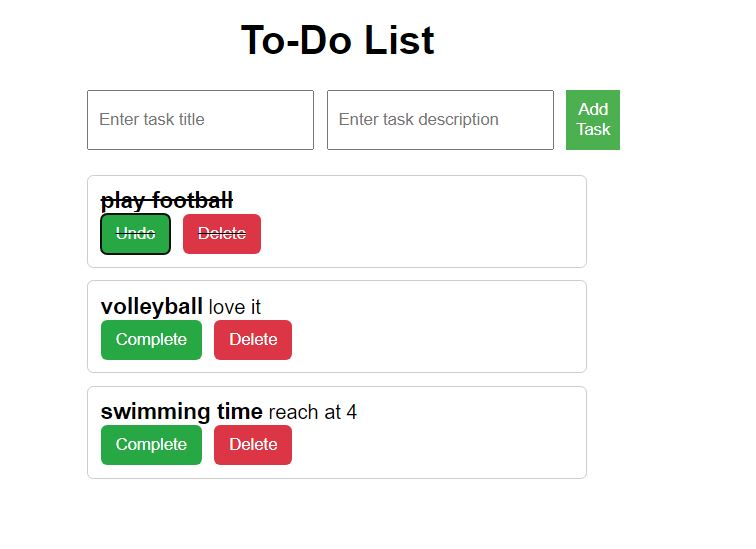

# To-Do List App

A basic RESTful API backend for a To-Do List application built using Node.js, Express.js, TypeScript, and SQLite database. The frontend communicates with the backend through the provided API endpoints.

## Installation

1. Clone the repository:

    `git clone https://github.com/ibr03/backendDevelopmentApplications.git
     cd backendDevelopmentApplications`

2. Install dependencies:

    `npm install`

3. Set up the database:

    The SQLite database is used for this project. The database file database.sqlite will be created automatically when you run the application.

4. Set up environment variables:

    Create a .env file in the root directory of the project and set the desired port for the server:

    `PORT=4000`

5. Build the TypeScript code:

    `npx tsc`

## Usage

1. Start the server

    `npm start`

2. Open your browser and navigate to http://localhost:4000 to access the To-Do List app.

## API Endpoints

    The API provides the following endpoints: 
        * GET /api/tasks: Get a list of all tasks.
        * POST /api/tasks: Create a new task.
        * PUT /api/tasks/:id: Update details of a specific task.
        * DELETE /api/tasks/:id: Delete a specific task.

    Check out this Postman collection for usage - 
    https://www.postman.com/telecoms-technologist-44260770/workspace/my-workspace/collection/26804310-e6c47803-285c-4b57-a741-09f26f88a5b1?action=share&creator=26804310

